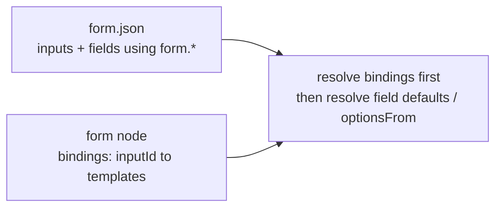

# Form reuse: inputs + bindings

**Status:** implemented  
**Addresses:** form TemplateField highlight gaps + reusable forms across flows  

## Problem

1. **Highlight** — number/json field defaults use plain `Input`, so templates look unstyled vs string fields.
2. **Reuse** — putting `{{nodes.profileForm.theme}}` in the shared `.form.json` ties that form to one flow’s node ids. Prefill on the form node already overrides defaults, but it is easy to miss and freeform.

## Design (chosen)

Treat the form file as a **contract**; treat each form node as the **wiring**.



### Schema

Extend `packages/schema/src/form.ts`:

```ts
inputs?: Array<{
  id: string;           // e.g. "theme", "products"
  label?: string;
  description?: string;
  type?: "string" | "number" | "boolean" | "json"; // default string
  required?: boolean;
}>
```

Field `default` / `optionsFrom.items` may use **`{{form.<inputId>}}`** (and nested paths like `{{form.user.name}}` if the bound value is an object).

Keep existing `env` / `input` / `nodes` / `vars` for power users, but **product guidance + Form editor lint**: prefer `form.*` for anything flow-specific.

Extend `packages/schema/src/nodes/form.ts`:

```ts
bindings?: Record<string, unknown>; // inputId → static or template
// Keep `value` as field-id prefill (current behavior) for backward compat
```

**Resolution order** (`form-resolve.ts` + engine resolver context):

1. Resolve `bindings` (and existing `value`) with the normal flow template scope.
2. Put the result on resolver context as `form` (new root alongside `env`, `nodes`, …).
3. Resolve field defaults / `optionsFrom` with that enriched scope.
4. Prefill precedence unchanged: field-id entries in `value` still override defaults for that field.

### Desktop UI

- **Form editor** — Inputs section (id, label, type, required). Hint on Defaults / optionsFrom: “Use `{{form.theme}}`; bind in each flow’s form node.” Soft warn if a default/`optionsFrom.items` contains `{{nodes.`.
- **Form node inspector** — Generated **Bindings** editor from the form’s `inputs` (one `TemplateField` per input), not only freeform JSON. Keep advanced `value` map for field-level overrides.
- **Highlight polish (same epic, small PR OK)** — Use `TemplateField` for number/json defaults (store template strings; coerce to number only when the value is a plain numeric literal).

### Samples / docs

- Update showcase confirm form: declare inputs (`username`, `theme`, `assigneeId`); defaults `{{form.*}}`; move `nodes.*` into the confirm form node’s `bindings`.
- Same pattern for pick-product `optionsFrom.items`: `{{form.products}}` bound from search HTTP in the flow.
- Short docs note under forms: reusable forms bind at the node.

### Out of scope

- Auto-infer bindings from previous node.
- Removing `value` (compat kept).
- Remappable `{{nodes.*}}` aliases inside the form file.

## Implementation order

1. Schema + engine/`form-resolve` + `{{form.*}}` in template roots + tests
2. Form editor Inputs UI + nodes-path warn + number/json TemplateField
3. Form node Bindings UI
4. Sample + changeset + ROADMAP note under Forms

## Done when

- A form with only `{{form.*}}` templates can be dropped into two flows with different node ids by setting bindings only.
- Number defaults with `{{form.x}}` highlight like strings.
- Showcase confirm no longer hardcodes `nodes.profileForm` inside the form file.

## Example

**`showcase-confirm.form.json` (reusable):**

```json
{
  "inputs": [
    { "id": "theme", "label": "Theme", "type": "string" },
    { "id": "assigneeId", "label": "Assignee", "type": "number" }
  ],
  "fields": [
    {
      "id": "theme",
      "type": "string",
      "readonly": true,
      "default": "{{form.theme}}"
    },
    {
      "id": "assigneeId",
      "type": "number",
      "readonly": true,
      "default": "{{form.assigneeId}}"
    }
  ]
}
```

**Flow A form node:**

```json
"bindings": {
  "theme": "{{nodes.profileForm.theme}}",
  "assigneeId": "{{nodes.pickUserForm.userId}}"
}
```

**Flow B form node:** different node ids in `bindings` only — same form file.
