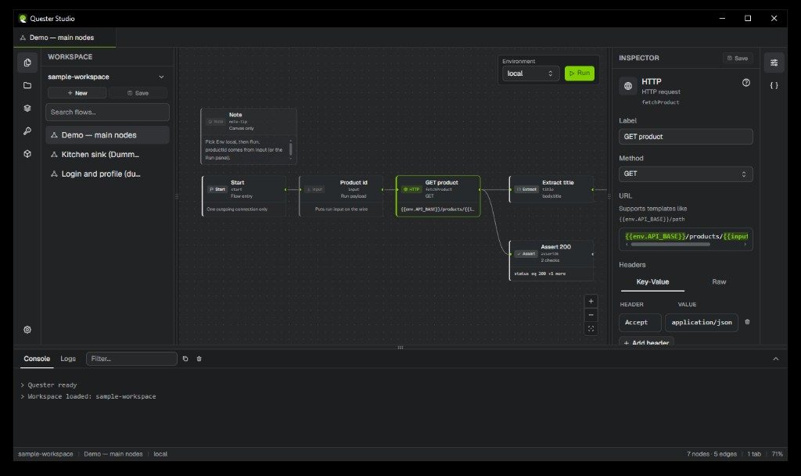

# Quester Studio

Design, chain, and regress API journeys — same git-friendly flows for developers, testers, and business analysts. **Quester Studio** is the desktop app and platform monorepo. Secrets stay on your machine.



- **Desktop app** — visual scenario builder (React Flow + Electrobun)
- **CLI** — `quester init`, `quester validate`, `quester run`, `quester suite`
- **Schema** — git-friendly `*.flow.json` workspace format

Builtin nodes include `start`, `input`, `http`, `extract`, `template`, `set`, `if`, `switch`, `delay`/`wait`, `foreach`, `try`, `subflow`, `output`, `assert`, `transform`, `merge`, `json`, `log`, `inspect`/`preview`, and canvas-only `note` (not executed). See the [node reference](https://9paradox.com/quester-studio/docs/nodes/).

Legacy [apitester](https://github.com/9paradox/apitester) remains separate.

## Docs

- [Product site](https://9paradox.com/quester-studio/) — download, guide, UI + CLI docs
- [Try Quester Studio](https://9paradox.com/quester-studio/docs/try/) — unsigned desktop preview
- [Contributing](./CONTRIBUTING.md)
- [Security](./SECURITY.md)
- [Roadmap](./ROADMAP.md)
- [Changelog](./CHANGELOG.md)

## Structure

```
apps/desktop   Quester Studio desktop app
apps/web       Product site + docs (https://9paradox.com/quester-studio/)
packages/schema   @quester-studio/schema
packages/engine   @quester-studio/engine
packages/nodes    @quester-studio/nodes
packages/cli      quester CLI
schemas/       JSON Schema emitted from @quester-studio/schema
```

## Requirements

- [Bun](https://bun.sh) 1.3.14 (see `packageManager` in root `package.json`)

## Quick start

```bash
bun install
bun run build
bun run test

# Scaffold a workspace
bunx --bun quester init ./my-workspace
bunx --bun quester validate ./my-workspace

# Sample workspace (DummyJSON) — hero scenario first
bunx --bun quester validate examples/sample-workspace
bunx --bun quester run examples/sample-workspace/flows/login-and-profile.flow.json \
  --workspace examples/sample-workspace --env local \
  --input "{\"username\":\"emilys\",\"password\":\"emilyspass\"}"
bunx --bun quester run examples/sample-workspace/flows/demo-main-nodes.flow.json \
  --workspace examples/sample-workspace --env local
```

Sample flows: `login-and-profile` (auth chain + asserts), `demo-main-nodes` (short node walkthrough), `echo-subflow` (minimal `subflow` target), `kitchen-sink` (every builtin, including delay/switch/try/foreach/subflow/log/inspect and a disconnected `note`).

## Monorepo tooling

- **Turborepo** (`turbo.json`) defines task graph and CI-friendly caching.
- Root `build` / `test` orchestrate packages via Bun workspaces (`bun run --filter …`) because Turborepo 2.10 does not yet enumerate Bun workspaces on this setup.

## License

MIT — Copyright (c) 2026 Akshay Gaonkar. See [LICENSE](./LICENSE).
